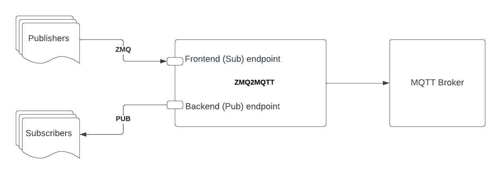

# ZMQ2MQTT

ZMQ2MQTT is a ZeroMQ to MQTT bridge service written in golang.

## Architecture
ZMQ2MQTT service is based on ZeroMQ [XSub-XPub pattern](https://netmq.readthedocs.io/en/latest/xpub-xsub/)

In a nutshell, it acts as a transparent Pub\Sub proxy with messages being also forwarder to MQTT. 

The service provider 2 ZMQ endpoints:
    - Frontend (Sub) - this is where publishers can connect to 
    - Backend (Pub) - this is where subscribers can connect to

## Build 
1. Install Go on your machine. golang version >1.20 is supported.  
2. Clone the repository.
3. Run `go mod download` to download the project dependencies.
4. Build using `go build` for your platform of choice. 
5. Optionally, you can build docker container by running `docker build . -f docker/Dockerfile --tag zmq2mqtt`

## Test 
You can run tests using standard `go test` command. Tests are also launched for commmits and PRs. 
For PRs, coverage statistic also appears in PR comments. 

## Deployment and configuration
There are several options to deploy the service
    - As a compiled binary launched as a service or cron job
    - As a docker container 

## Contributing

1. Fork the repository.
2. Create a new branch for your feature or bug fix.
3. Make your changes and commit them with descriptive commit messages.
4. Push your changes to your fork.
5. Submit a pull request to the main repository.

## License

This project is licensed under the MIT License - see the [LICENSE](LICENSE) file for details.

